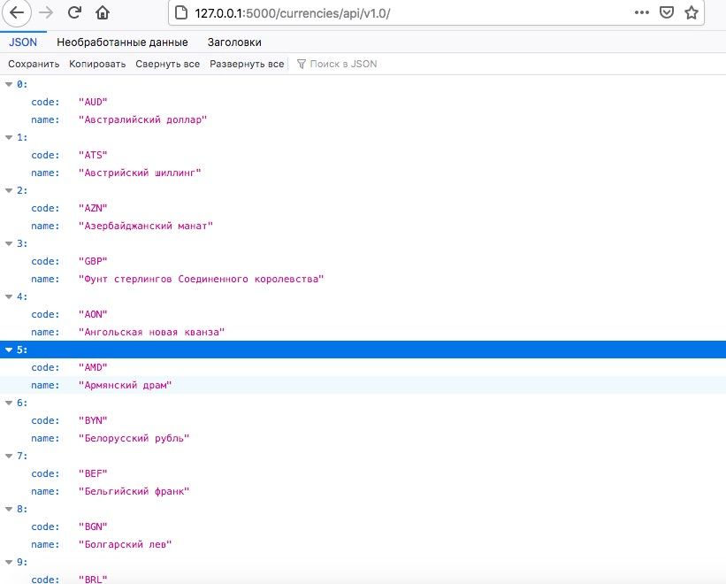
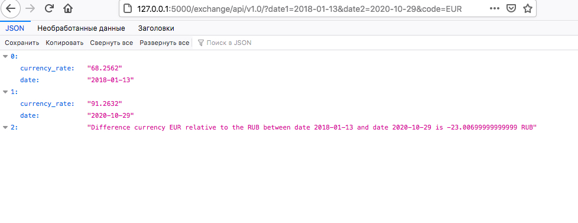

# Test for mcart #

## Реализован микросервис на Flask, предоставляющий  http api, для показа разницы курса той или иной валюты относительно рубля за выбранные даты. ##
### Модуль helper.py содержит дополнительные методы для реализации сервера. 
### Для реализации потребовались: Flask как легковесный фреймворк подходит для реализации данного микросервиса, xml.etree для парсинга и обработки формата XML, urllib для обработки запросов, datetime для валидации даты. 

1. Клонировать репозиторий  `git@github.com:audiopie/test_art.git`
2. Установить зависимости `pip install -r requirements.txt`
2. Открыть терминал, запустить python и скрипт командой `python main.py`. 
3. Сервер будет доступен на порту http://127.0.0.1:5000/ 

HTTP API использует класс helperAPI описан в модуле helper.py. При запуске программы создается инстанс 
класса helperAPI. В экземпляр класса передается обьект класса Element tree,
который является результатом парсинга страницы сайта банка, таким образом запрос на получение списка валют выполняется 
единожды при запуске программы.  
При получении данных о разнице курса, данные валидируются на полное отсутсвие данных в запросе,
на корректность кода валюты, а также валидируется даты(например получении данных даты в будущее выдаст ответ
о не корректности даты)
Для того чтобы не выполнять запрос на заданный день повторно, если он уже выполнялся когда-либо, реализован кеш, при 
запросе сначала проверится если указанная дата и данные в кеше, если нет то запрос будет выполнен. Таким 
образом мы избегаем повторных запросов на сервис банка.
### Сервер поддерживает следующие методы: ###

1. Метод возвращает все валюты, которые можно использовать (символьный код (RUB, EUR), название). Список взят отсюда http://www.cbr.ru/scripts/XML_valFull.asp

 

2.Метод возвращает разницы курса относительно рубля между двумя датами за выбранную дату, принимает символьный код валюты, и две даты. Возвращает курс за первую дату, курс за вторую дату и разницу между ними.

 

