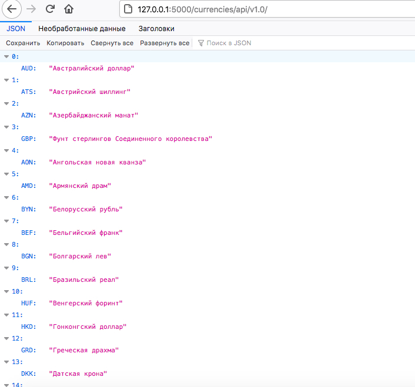

# Test for mcart #

## Реализован микросервис на Flask, предоставляющий  http api, для показа разницы курса той или иной валюты относительно рубля за выбранные даты. ##
### Модуль helper.py содержит дополнительные методы для реализации сервера. Для реализации потребовались только встроенные библиотеки языка Python.

1. Клонировать репозиторий  `git@github.com:audiopie/test_art.git`
2. Открыть терминал, запустить python и скрипт командой `python main.py`. 
3. Сервер будет доступен на порту http://127.0.0.1:5000/ 

### Сервер поддерживает следующие методы: ###

1. Метод возвращает все валюты, которые можно использовать (символьный код (RUB, EUR), название). Список взят отсюда http://www.cbr.ru/scripts/XML_valFull.asp

 

2.Метод возвращает разницы курса относительно рубля между двумя датами за выбранную дату, принимает символьный код валюты, и две даты. Возвращает курс за первую дату, курс за вторую дату и разницу между ними.

 

